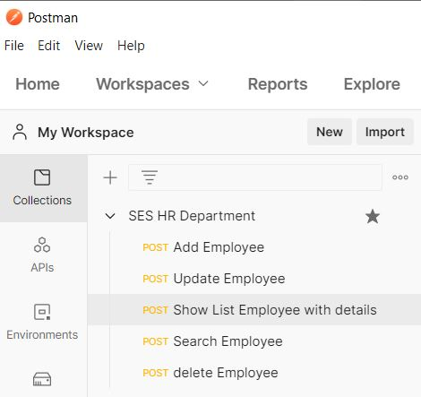
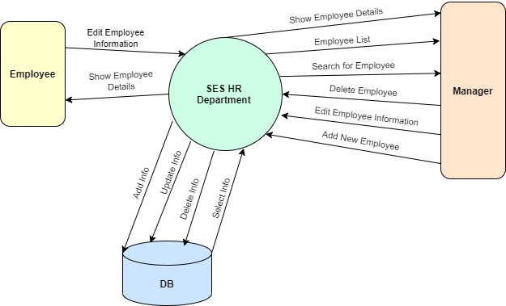
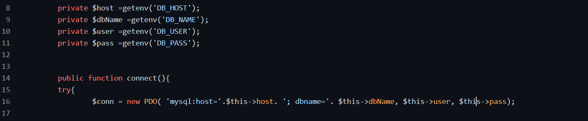
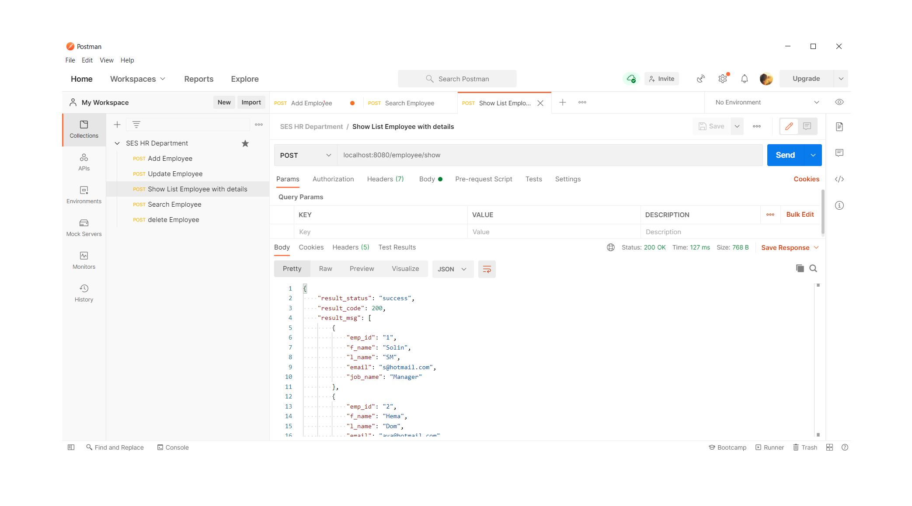
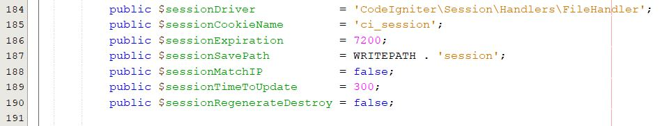

# SES HR Department

## Introduction:
This project is created for a master course using 12-factors in PHP. 
You can find our project in a folder called "SES-HR-Department". 
In the "php - services" folder, you can find the same services but in pure php. 
And in folder called "related_files" you can find ( MySQL Database , Postman json file )

SES HR department is a project containing (add / edit / delete / search / show list / show info) for employees, where those services are an API. The main aim is to walk through 12-factor and implement them in our project. Implement "SES HR Department.postman_collection.json" file to Postman to view API services & results. We start by creating an Online Google Document to find all information. And then learn about Git vs Github with differences between them, important keywords in GitHuh, create an account in GitHub, interact with it.deal with Desktop GitHub.

## Technical used in SES HR Department
The techniques used to develop the API are Codeigniter framework using PHP script Language with RESTFUL API. Connecting it with PHPMyAdmin Database (MySQL) and using the kanban project of GitHub. In addition, using Docker.
| Technical                 | Description                                          |
| ------------------------- | -----------------------------------------------------|
| CodeIgniter 4 Framework   | It powerful PHP framework with a very small footprint. It supports REST APIs and we create 1 class containing 5 functions, where each function is represented as a service (This is a way to define services if they are related to the same object as an employee).  Link : https://codeigniter.com/                  |
| MySQL Database            | PHPMyAdmin, put in code we use MySQLi & PDO          |
| Postman                   | Used to view APIs services & results                 |
| Kanban Project            | To manage services between team members and also manage work on repo.         |
| GitHub                    | To Upload our work on it and create a repository (first factor)               |
| Desktop GitHub            | To help us to upload, send pull request, see any changes on the code          |
| Docker                    | Helps to implement many factors with our project                              |
| Docker Compose            | It is a tool for defining and running multi-container Docker applications     |
| Composer.json             | It allows you to create a list of dependencies that needs to be downloaded and installed during the deployment of the application  |
| Yamel                     |         |
| Kubernetus                |         |

## Our Services
1. Show Employee List service
2. Show Employee Details service
3. Search For Employee service
4. Add New Employee service
5. Edit employee Information service
6. Delete Employee service            

## APIs
| Service             | Method        | Link                      |
| ------------------- |:-------------:| :-------------------------|
| Add Employee        |   /POST       | /employee/add             |
| Edit Employee       |   /POST       | /employee/update          |
| Employee Info       |   /POST       | /employee/show  + param.  |
| Search for Employee |   /POST       | /employee/search          |
| Delete Employee     |   /POST       | /employee/delete          |
| All Employee        |   /GET        | /employee/show            |

 

## Context Diagram

## 12-Factor:
**1. Codebase**
> One codebase tracked in revision control, many deploys ✔
> We have no particular problems here, it’s just a matter of development workflow. 
> We can track our app code in Git: the master branch is deployed to production, while 
> all the development and testing is made under separate branches.

**2. Dependencies**
>* In Codeigniter, the REST API is added as a system library.
>* We add Docker_php to allow php commands in docker
>* We add Docker_phpMyAdmin for DB commands in docker
>* We add Docker_MySQL for mySQL queries command in docker
>* There is a file named config that works on the connection with the Databases, which is MySQL
With the new version of the web we will be working on using

**3. Config**
> "Explicitly declare and isolate dependencies"

> We got this too, we have Composer for PHP dependencies.

> In PHP you can use composer, which basically allows you to create a list of dependencies that needs to be downloaded and installed during the deployment of the application. So, we create `composer.json` for codeigniter and file docker `DockerFile` which used to help and applied docker commands. 

> In codeigniter there is a files for config of DB, connect to host, and routes. And to deal with, we used `.env file`

> For **pure php** you can use `getenv function` as image:

**4. Backing services**
> We create 6 services as shown in the previous topic and it is APIs. Also we add some dependencies with is as backig services to the docker.

> As example of third parity (adding some commands and files to Codeigniter project).

> Here we’re talking about databases (MySQL), queue services, SMTP servers and caching systems. In some cases, even the filesystem should be considered a backing service, for example when running on Heroku, where the local filesystem is reset at each deployment.

> Just like factor #3, this is more a design task than a technical limit. We need to design our application in a way that both local and remote resources are treated equal and can be swappable.

> Example for service:

**5. Build, release, Run**
>Deployment tools typically offer release management tools, most notably the ability to roll back to a previous release.
>An approach is to store releases in a subdirectory named releases, where the current release is a symlink to the latest release binary. This makes it easy to quickly roll back to a previous release.
>In PHP the run stage is usually delegated to an Apache or Nginx server (and we test both) that may need to be restarted or reloaded on each deploy . 

>* Build
Converts a code repo into an executable bundle. we’ve already do this with our Dockerfile.

>* Release
Takes the build and combines it with the current configuration. In a purely docker based system this can be split between the Build (versioning and defaults) and Run (current config) stages. However systems like Heroku and Deis have a seperate step for this which they handle internally.

>* Run
Runs the application by launching a set of the app’s processes against a selected release. In a docker based system this is simply the $ docker run command which can be called via a deploy script, or a init script (systemd/runit)

**6. Processes**
> Twelve-factor processes are stateless and share-nothing. Any data that needs to persist must be stored in a stateful backing service, typically a database.

> A twelve-factor app never assumes that anything cached in memory or on disk will be available on a future request, because chances are high that a future request will be served by a different process

> PHP processes are already stateless and shared-nothing, although sometimes we tend to use the built-in file storage for sessions, and this is not advisable on a cloud platform. We can avoid this pitfall by session handlers:

**7. Port binding**
 > IP sockets (especially TCP/IP sockets) are a mechanism allowing communication between processes over the network. In some cases, you can use TCP/IP sockets to talk with 
 > processes running on the same computer (by using the loopback interface, a.k.a. 127.0.0.1).

 > A Unix socket is an inter-process communication mechanism that allows bidirectional data exchange between processes running on the same machine
 > App exposing 80 and 443 port and the Default dev port is 8181
 > Well, this is a bit tricky because PHP has been designed to use a web server. Some providers, like Heroku, address the issue by embedding the web server into the application as a dependency, through their PHP Buildpack that runs Apache or Nginx and we are using both in foreground mode.
>* Export services via port binding

Your application should appear to be completely self contained and not require runtime injection of a webserver. Thankfully this is pretty easy to fake in a docker container as any extra processes are isolated in the container and effectively invisible to the outside.

It is still preferable to use a native language based web library such as jetty (java) or flask (python) but for languages like PHP using apache or nginx is ok.

Docker itself takes care of the port binding by use of the -p option on the command line. It’s useful to register the port and host IP to somewhere ( etcd ) to allow for loadbalancers and other services to easily locate your application.

**8. Concurrency**
> They should rely on the operating system's process manager (such as systemd) to manage output streams, respond to crashed processes, and handle user initiated restarts and shutdowns. This makes adding more concurrency a simple and reliable operation.

> It also be means for scalability on service and we handeal this by using Kubernetes that can determine when to scale out and scale down reffered to users requests.

> **Scale out via the process model**

> Similar to factor #7, the dependency from a web server makes PHP different. However, every request/response is handled by its own process so we can safely assume that PHP uses the process model.

**9. Disposability**
> By using Docker and K8s this allows the system to be fast startup & graceful shutdown. 

>  **Fast Startup:** 
>  The time starts from executing the launch command until the process is up and ready to receive requests (Minimize processes startup time).

>  **Graceful Shutdown:**
>    * **For Web Process:** Stop listening to the service port (refusing any new requests & finish it, then exiting). This means HTTP requests should be short.
>    * **For Worker Process:** Return the current job to a work queue manually. When a worker disconnects, queuing systems return the job automatically to the queue. Jobs can be reentrant, by wrapping the results in a transaction (to allow rollbacks)

**10. Dev/prod parity**
> "Keep all deploys similar as you can"
> It helps to minimize the gap in time, employee, tool, and deploys (between development and production).

**11. Logs**

**12. Admin processes**

