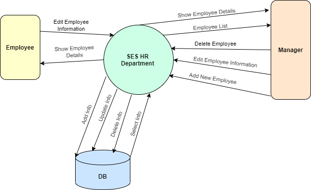

# SES HR Department

## Introduction:
This project is created for a master course using 12-factors in PHP. 
You can find our project in a folder called "SES-HR-Department". 
In the "php - services" folder, you can find the same services but in pure php. 
And in folder called "related_files" you can find ( MySQL Database , Postman json file )

SES HR department is a project containing (add / edit / delete / search / show list / show info) for employees, where those services are an API. The main aim is to walk through 12-factor and implement them in our project. Implement "SES HR Department.postman_collection.json" file to Postman to view API services & results. We start by creating an Online Google Document to find all information. And then learn about Git vs Github with differences between them, important keywords in GitHuh, create an account in GitHub, interact with it.deal with Desktop GitHub.

## Technical used in SES HR Department
The techniques used to develop the API are Codeigniter framework using PHP script Language with RESTFUL API. Connecting it with PHPMyAdmin Database (MySQL) and using the kanban project of GitHub. In addition, using Docker.
| Technical                 | Description                                          |
| ------------------------- | -----------------------------------------------------|
| CodeIgniter 4 Framework   | It supports REST APIs and we create 1 class containing 5 functions, where each function is represented as a service (This is a way to define services if they are related to the same object as an employee).                   |
| MySQL Database            | PHPMyAdmin, put in code we use MySQLi & PDO          |
| Postman                   | Used to view APIs services & results                 |
| Kanban Project            | To manage services between team members and also manage work on repo.         |
| GitHub                    | To Upload our work on it and create a repository (first factor)               |
| Desktop GitHub            | To help us to upload, send pull request, see any changes on the code          |
| Docker                    | Helps to implement many factors with our project                              |

## Our Services
1. Show Employee List service
2. Show Employee Details service
3. Search For Employee service
4. Add New Employee service
5. Edit employee Information service
6. Delete Employee service

## APIs
| Service             | Method        | Link                      |
| ------------------- |:-------------:| :-------------------------|
| Add Employee        |   /POST       | /employee/add             |
| Edit Employee       |   /POST       | /employee/update          |
| Employee Info       |   /POST       | /employee/show  + param.  |
| Search for Employee |   /POST       | /employee/search          |
| Delete Employee     |   /POST       | /employee/delete          |
| All Employee        |   /GET        | /employee/show            |

## Context Diagram

